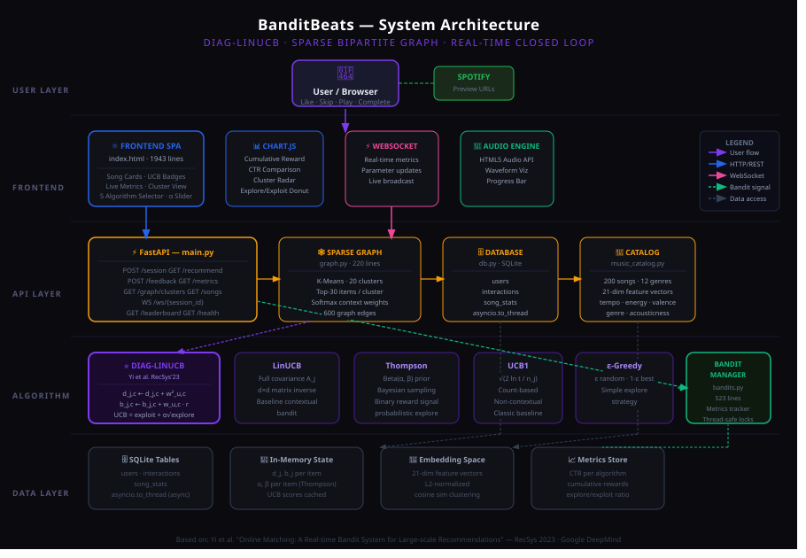
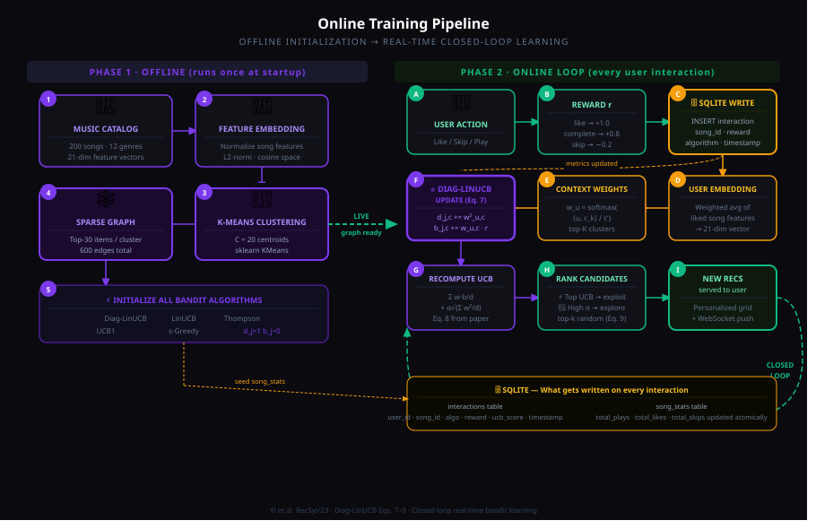

# 🎵 BanditBeats — Multi-Armed Bandits for Music Recommendation

> **EE 216 · Machine Learning for Signal Processing**  
> From classical MAB exploration to a full production-grade Diag-LinUCB system

<div align="center">

| Name | Roll Number |
|------|-------------|
| Akarsh J | 240002007 |
| Ninad Atul Kulkarni | 240002032 |

</div>

---

## 📖 Table of Contents

1. [Project Journey](#-project-journey)
2. [Phase 1 — Classical MAB Foundations](#-phase-1--classical-mab-foundations-ee-216-assignment)
3. [Phase 2 — BanditBeats: Implementing the DeepMind Paper](#-phase-2--banditbeats-implementing-the-deepmind-paper)
4. [System Architecture](#-system-architecture)
5. [Online Training Pipeline](#-online-training-pipeline)
6. [Key Algorithm: Diag-LinUCB](#-key-algorithm-diag-linucb)
7. [Installation & Running](#-installation--running)
8. [API Reference](#-api-reference)
9. [Results & Metrics](#-results--metrics)
10. [Paper Citation](#-paper-citation)

---

## 🗺 Project Journey

This project has two distinct phases that build on each other:

```
Phase 1 (EE 216 Assignment)          Phase 2 (BanditBeats)
─────────────────────────            ──────────────────────────────────
Classical MAB on logged data    ──►  Diag-LinUCB on real-time music data
ε-Greedy, UCB, LinUCB               Sparse bipartite graph + WebSocket
Off-policy evaluation               Live closed-loop feedback learning
10 arms, 10k events                 200 songs, 5 algorithms, FastAPI
```

We started by understanding *why* bandits work — off-policy evaluation, the exploration-exploitation tradeoff, and what contextual information actually buys you. That foundation made the real implementation meaningful rather than mechanical.

---

## 📚 Phase 1 — Classical MAB Foundations (EE 216 Assignment)

### Overview

A simulation study evaluating MAB algorithms on a real-world logged recommendation dataset, using **Off-Policy Evaluation (OPE)** to get unbiased performance estimates from historical data.

### Dataset

`data.txt` — **10,000 user interaction events** collected under a uniform random policy.

| Column | Description |
|--------|-------------|
| 1 | Arm selected (1–10, one of 10 news articles) |
| 2 | Observed reward (1 = click, 0 = no click) |
| 3–102 | Context vector (100 features) |

**Context structure:** 10 arms × 10 features each, ordered sequentially.  
Features 1–10 → Arm 1, Features 11–20 → Arm 2, ..., Features 91–100 → Arm 10.

### Implemented Algorithms

#### 🟢 Classical (Non-Contextual) MAB

| Algorithm | Core Idea |
|-----------|-----------|
| **ε-Greedy** | With probability ε explore randomly; otherwise exploit the best-known arm |
| **UCB1** | `UCB = mean + √(2 log t / n)` — optimism in the face of uncertainty |

#### 🔵 Contextual Bandit Algorithms

| Algorithm | Core Idea |
|-----------|-----------|
| **LinUCB** | Ridge regression per arm with UCB exploration bonus; full d×d covariance |
| **TreeBootstrap** | Ensemble of regression trees trained on bootstrap samples; uncertainty via variance across trees |
| **KernelUCB** | Kernelised version of LinUCB; captures non-linear reward structure |

### Evaluation: Off-Policy Evaluation (OPE)

Since we can't re-run the world, we use the **replay method**:
- Only count rounds where our algorithm's chosen action **matches** the logged action
- Reward is then observed (unbiased)
- Provides a statistically valid comparison across algorithms on the *same* data

**Key insight from Phase 1:** LinUCB consistently outperformed non-contextual methods once the context features aligned with true reward structure. But its O(d²) memory cost per arm hinted at a scalability problem — which the Phase 2 paper directly solves.

---

## 🚀 Phase 2 — BanditBeats: Implementing the DeepMind Paper

**BanditBeats** is a full end-to-end music recommendation system implementing the core algorithm from:

> Yi, J., Ghosh, A., Vartak, M., Hong, L., Chi, E., & Zheng, N. (2023).  
> **"Online Matching: A Real-time Bandit System for Large-Scale Recommendations."**  
> *RecSys '23. Google DeepMind / YouTube.*

### What We Built

| Component | Description |
|-----------|-------------|
| **Diag-LinUCB** | Diagonal approximation of LinUCB — O(1) update, no matrix inversion |
| **Sparse Bipartite Graph** | Offline graph connecting user clusters to candidate items |
| **Online Policy Update** | Real-time parameter updates on every like/skip/play event |
| **Exploration Bonus** | UCB exploration term calibrated by α slider |
| **5 Algorithms** | Diag-LinUCB, LinUCB, Thompson Sampling, UCB1, ε-Greedy |
| **200 Songs** | 12 genres, rich audio features (tempo, energy, valence, etc.) |
| **FastAPI + WebSocket** | Real-time metric streaming to a live dashboard |

### Why This Paper?

Phase 1 showed us LinUCB works — but it has a fundamental problem at scale:
- **Memory:** O(d²) covariance matrix per arm (200 songs × 21² features = prohibitive at YouTube's millions of videos)
- **Update cost:** O(d²) per feedback event
- **No structure sharing:** each arm is learned independently

The DeepMind paper solves this by:
1. **Diagonal approximation** — only keep the diagonal of A_j, dropping to O(d)
2. **Sparse bipartite graph** — share structure across a cluster graph so items only need to be updated for *relevant* user clusters
3. **Softmax user weights** — smooth interpolation over K nearest clusters rather than hard assignment

---

## 🏗 System Architecture

> The diagram below shows the full layered architecture from user browser to bandit algorithm. Commit `banditbeats_system_architecture.svg` to your repo and it will render natively on GitHub.



**Layer breakdown (top to bottom):**

- **User Layer** — Browser sessions, preference signals (genre, tempo, energy)
- **Frontend** — Single-page app with Chart.js dashboard, WebSocket real-time updates, UCB decomposition panel
- **API Layer** — FastAPI on `:8000`, REST endpoints + WebSocket `/ws/{session_id}`
- **Algorithm Layer** — Diag-LinUCB (primary) + 4 baselines running in parallel for comparison
- **Data Layer** — SQLite for feedback events, in-memory bandit state (b, d matrices), sparse cluster graph

---

## 🔄 Online Training Pipeline

> The diagram below shows how the offline initialization feeds into real-time closed-loop learning.



**Two-phase structure:**

**Offline (runs once at startup):**
1. Load 200-song catalog with 21-dim feature vectors
2. Normalize features → embedding space
3. K-Means clustering (C=20 clusters)
4. Assign top-W songs per cluster as candidates
5. Build sparse bipartite graph G(U, V, E)

**Online (real-time, per request):**
- **A** — Compute user embedding from preference signals
- **B** — Assign user to top-K clusters, compute softmax weights w_{u,c}
- **C** — Retrieve candidate items from cluster neighborhood in graph
- **D/E/F** — Score each candidate: UCB = exploitation term + exploration bonus
- **G** — Return top-N ranked songs to frontend
- **H/I** — User feedback (like/skip/play/complete) → update b_{j,c} and d_{j,c} → WebSocket broadcast

---

## 🧮 Key Algorithm: Diag-LinUCB

### Why Diagonal?

Classic LinUCB maintains a full **d×d covariance matrix** A_j per item:
- Memory: O(d²) per item — prohibitive at YouTube scale (millions of videos)
- Update cost: O(d²) per feedback
- Requires matrix inversion for scoring

**Diag-LinUCB** approximates A_j with only its **diagonal** d_j:
- Memory: **O(d)** per item per cluster
- Update cost: **O(1)** per feedback (scalar operations only)
- Score computation: **O(K)** where K = active clusters per user

The statistical efficiency loss from dropping off-diagonal terms is offset by having *far more data points* per parameter — the cluster structure means many users contribute to each (item, cluster) pair.

### Equations (from the paper)

**UCB Score — Eq. 7:**

$$\text{UCB}_j(u) = \sum_{c \in \text{supp}(w_u)} \frac{w_{u,c} \cdot b_{j,c}}{d_{j,c}} + \alpha \sqrt{\sum_{c \in \text{supp}(w_u)} \frac{w_{u,c}^2}{d_{j,c}}}$$

**Diagonal Update — Eq. 8:**

$$d_{j,c} \leftarrow d_{j,c} + w_{u,c}^2$$

**Mean Vector Update — Eq. 9:**

$$b_{j,c} \leftarrow b_{j,c} + w_{u,c} \cdot r_{u,j}$$

**User Cluster Weights — Eq. 10:**

$$w_{u,c} = \text{softmax}\!\left(\frac{\langle u,\, \mu_c \rangle}{\tau'}\right) \quad \text{for } c \in \text{top-}K\text{ clusters}$$

**Where:**
- `w_{u,c}` — weight of user u in cluster c (sparse, only K non-zeros)
- `b_{j,c}` — reward numerator for item j in cluster c
- `d_{j,c}` — diagonal covariance (confidence) for item j in cluster c
- `α` — exploration bonus strength (tunable via UI slider, 0.1–3.0)
- `τ'` — softmax temperature (default 0.3)
- `K` — clusters per user (default 5), `C` — total clusters (default 20)

### Algorithm Comparison

| Algorithm | Memory / Item | Update Cost | Context-Aware | Cluster-Aware |
|-----------|:---:|:---:|:---:|:---:|
| **Diag-LinUCB** ⭐ | O(d·C) | O(1) | ✅ | ✅ |
| LinUCB | O(d²) | O(d²) | ✅ | ❌ |
| Thompson Sampling | O(1) | O(1) | ❌ | ❌ |
| UCB1 | O(1) | O(1) | ❌ | ❌ |
| ε-Greedy | O(1) | O(1) | ❌ | ❌ |

---

## 📁 Project Structure

```
music-bandit-recommender/
├── backend/
│   ├── requirements.txt         # Python dependencies
│   ├── music_catalog.py         # 200 songs with audio features
│   ├── bandits.py               # DiagLinUCB + 4 baseline algorithms
│   ├── graph.py                 # Sparse bipartite graph (Algorithm 2)
│   ├── database.py              # Async SQLite (aiosqlite)
│   └── main.py                  # FastAPI app: REST + WebSocket
├── frontend/
│   └── index.html               # Complete SPA (Chart.js, WebSocket)
├── banditbeats_system_architecture.svg
├── banditbeats_online_training_flow.svg
├── start.sh                     # One-command startup
└── README.md
```

---

## ⚡ Installation & Running

### Prerequisites

- Python 3.9+
- pip

### Quick Start

```bash
git clone <your-repo-url>
cd music-bandit-recommender
bash start.sh
```

Then open `frontend/index.html` in your browser.

### Manual Start

```bash
cd backend
pip install -r requirements.txt
uvicorn main:app --host 0.0.0.0 --port 8000 --reload
```

Open `frontend/index.html` directly (no web server needed — it uses `fetch` against `localhost:8000`).

API docs auto-generated at: **http://localhost:8000/docs**

---

## 🌐 API Reference

| Method | Path | Description |
|--------|------|-------------|
| GET | `/health` | System health + graph status |
| GET | `/songs` | All 200 songs with stats |
| POST | `/session` | Create/retrieve user session |
| GET | `/recommend/{session_id}` | Get recommendations |
| POST | `/feedback` | Submit like/skip/play/complete |
| GET | `/metrics` | All algorithm performance metrics |
| GET | `/graph/clusters` | Cluster info + top songs |
| GET | `/leaderboard` | Top songs by engagement per genre |
| WS | `/ws/{session_id}` | Real-time metric updates |

**Recommendation query params:**
```
GET /recommend/{session_id}
  ?algorithm=diag_linucb     # diag_linucb | linucb | thompson | ucb1 | epsilon_greedy
  &n=12                      # number of recommendations
  &alpha=1.0                 # exploration bonus (overrides UI slider)
  &explore_only=false        # pure exploration mode
```

**Feedback body:**
```json
{
  "session_id": "...",
  "song_id": "song_042",
  "action": "like",
  "algorithm": "diag_linucb",
  "ucb_score": 1.234,
  "was_exploration": false
}
```

**Reward values:**

| Action | Reward |
|--------|:------:|
| like | +1.0 |
| complete | +0.8 |
| play | +0.3 |
| skip | −0.2 |

---

## 📊 Results & Metrics

The dashboard shows real-time metrics per algorithm:

| Metric | Description |
|--------|-------------|
| **CTR** | Click-through rate: likes / total interactions |
| **Avg Reward** | Mean reward across all interactions |
| **Cumulative Reward** | Total reward over time (learning curve) |
| **Exploration Ratio** | Fraction of picks driven by uncertainty |

**Expected behavior:** Diag-LinUCB converges to higher CTR than baselines after ~20–50 interactions as it learns user cluster preferences. The 🔭 icon on song cards marks **exploration picks** (high UCB uncertainty); ⚡ marks **exploitation picks** (high predicted reward).

**Exploration / Exploitation tradeoff (α slider):**
- **Low α (0.1)** → heavy exploitation — recommends well-known songs
- **High α (3.0)** → heavy exploration — tries uncertain/new items

---

## 📄 Paper Citation

```bibtex
@inproceedings{yi2023online,
  title     = {Online Matching: A Real-time Bandit System for Large-Scale Recommendations},
  author    = {Yi, Jiaxi and Ghosh, Arnab and Vartak, Manasi and Hong, Lichan and Chi, Ed and Zheng, Niao},
  booktitle = {Proceedings of the 17th ACM Conference on Recommender Systems},
  year      = {2023},
  publisher = {ACM},
  note      = {Google DeepMind / YouTube}
}
```

---

<div align="center">

*EE 216 — Machine Learning for Signal Processing*  
*From 10 arms and a CSV to a real-time bandit system — one equation at a time.*

</div>
